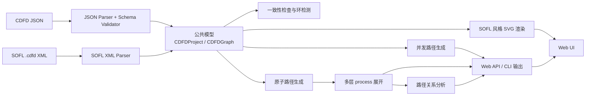

# CDFD Path Generator

一个用于导入 CDFD、生成源点到终点路径、分析路径关系并可视化图结构的 Python 工具。

CDFD 全称为 **Conditional Data Flow Diagram**。本项目围绕以下主线工作：

```text
导入 CDFD -> 转换为公共图模型 -> 生成原子路径/并发路径 -> 分析关系 -> SVG 可视化
```

## 当前功能

- 标准 `cdfd-json-v1` JSON 输入
- SOFL 桌面工具 `.cdfd` XML 导入
- JSON Schema 校验和 CDFD/module 一致性检查
- 单层及多层 process 分解
- 简单路径和有界环路路径生成
- process 输入/输出端口建模：端口内 AND，多端口默认 XOR
- 结构化并发路径生成：`A -> [B || C] -> D`
- 数据流、控制条件和状态信息收集
- 并行、互斥选择和汇合路径关系分析
- SOFL 风格节点、连线和多层图可视化
- Web UI 和命令行两种使用方式
- text、JSON、CSV、Markdown 结果输出

输入格式只保留：

1. **CDFD JSON**：项目的标准交换格式，能够完整表示 module、process、多层图、控制条件和显式结构。
2. **SOFL `.cdfd`**：兼容 SOFL 桌面工具的 XML 图文件。

YAML 和 CSV 不作为 CDFD 输入格式。CSV 仍可作为路径分析结果的导出格式。

## 系统架构



### 1. 输入与解析层

相关代码：

- `src/cdfd/parsers/__init__.py`
- `src/cdfd/parsers/sofl_xml.py`
- `src/cdfd/schemas/cdfd-json-schema.json`

JSON 输入先通过 JSON Schema 校验，再转换为公共模型。

SOFL `.cdfd` 是 XML 文件。解析器读取：

- `<componentList>`：确定 process、data store、condition 等节点；
- `<connectionList>`：确定 data flow、active data flow 和 control data flow；
- `shapeIndex`、`belongToName`：匹配连线端点；
- `fromX/fromY/toX/toY`：当端点信息不完整时进行坐标匹配；
- `x/y/width/height`：保留 SOFL 原始布局。

`.cdfd` 不需要先生成一个 JSON 文件再运行算法。两种输入都会直接转换成相同的内存模型：

```text
CDFD JSON -------\
                  -> CDFDProject / CDFDGraph -> 图算法
SOFL .cdfd XML --/
```

### 2. 公共模型层

模型定义在 `src/cdfd/models.py`。

主要对象：

- `CDFDProject`：整个项目，包括 module、process 定义和多个图层；
- `CDFDGraph`：一个 CDFD 图层；
- `Node`：process、data store、condition、state、external 等节点；
- `Edge`：数据流、活跃数据流或控制流；
- `GraphStructure`：parallel、choice、join 等显式结构；
- `PortSpec`：process 输入/输出端口；端口内数据为 AND，多端口默认为 XOR；
- `PathResult`：生成的一条原子路径；
- `ConcurrentPathResult`：包含 sequential/parallel 树的并发路径；
- `PathRelation`：多条路径之间的关系。

图算法只依赖公共模型，不关心输入最初来自 JSON 还是 `.cdfd`。

### 3. 图算法层

相关代码：

- `src/cdfd/path_finder.py`
- `src/cdfd/concurrent_paths.py`
- `src/cdfd/multilevel.py`
- `src/cdfd/path_groups.py`

处理流程：

1. 根据数据流识别源点和终点；
2. 生成源点到终点的原子路径；
3. 将控制流作为路径条件，而不是路径中的数据流步骤；
4. 递归展开带有 `decom` 的 process；
5. 生成结构化并发路径；
6. 分析路径之间的 parallel、exclusive 和 joined-output 关系。

路径定义不是单纯的节点列表。项目区分三层结果：

- `paths`：原子路径，沿数据流边形成的源点到终点有向轨迹；
- `concurrent_paths`：结构化并发路径，用 sequential/parallel 树表达偏序；
- `functional_scenarios`：路径之上的检查场景，不等同于 path。

原子路径示例：

```text
IN --[x1]--> A --[x2]--> B --[x4]--> OUT_X4
```

独立分支可以作为不同原子路径，其关系单独表示：

```text
P1 || P2
```

并发路径可以表示为：

```text
IN -> A -> [ B || C ] -> OUT
```

互斥选择使用 `XOR`，汇合关系使用 `+`。当 process 有多个输入端口或输出端口时，默认语义是一次只激活一个端口；同一个输出端口内列出的多条输出边可视为一次激活共同产生的数据，不同输出端口之间若要同时激活则需要在 `structures` 中显式声明 `parallel` 或 `fork`。

### 4. 检查与辅助分析

相关代码：

- `src/cdfd/consistency.py`
- `src/cdfd/scenarios.py`

一致性检查包括：

- process 节点是否有对应的 process specification；
- process 输入输出是否与图中的数据流一致；
- 数据流是否在 `module.var` 中声明；
- data store 是否断连；
- 多层 process 是否引用了存在的子图。

Functional Scenario 是路径之上的辅助分析结果，不等同于路径，也不是当前 Web UI 的主展示内容。

### 5. 展示与输出层

相关代码：

- `src/cdfd/exporters.py`
- `src/cdfd/web.py`
- `src/cdfd/templates/index.html`
- `src/cdfd/cli.py`

图形由项目自己的 SVG 渲染器生成，不依赖 Graphviz 或 Mermaid：

- Process 使用 SOFL process 框架；
- Data Store 使用分区矩形；
- Condition 使用菱形；
- 数据流使用实线箭头；
- 控制流使用点状箭头；
- SOFL `.cdfd` 优先使用文件保存的原始坐标；
- JSON 图在没有布局数据时由项目自动排版。

## 目录结构

```text
CDFD/
|-- docs/                         # JSON 格式、Schema 和研究记录
|-- examples/                     # JSON 与 SOFL .cdfd 示例
|-- src/cdfd/
|   |-- parsers/                  # JSON 和 SOFL XML 解析
|   |-- schemas/                  # 打包使用的 JSON Schema
|   |-- templates/                # Web UI
|   |-- models.py                 # 公共数据模型
|   |-- path_finder.py            # 单图路径算法
|   |-- concurrent_paths.py        # 并发路径树与符号化
|   |-- multilevel.py             # 多层 process 展开
|   |-- path_groups.py            # 路径关系分析
|   |-- consistency.py            # 一致性检查
|   |-- exporters.py              # SVG 和结果导出
|   |-- web.py                    # FastAPI Web/API
|   `-- cli.py                    # 命令行入口
|-- tests/                        # 自动化测试
|-- pyproject.toml                # 项目元数据与可编辑安装配置
`-- requirements.txt              # 开发和运行依赖
```

## 环境要求

- Python `3.11` 或更高版本
- pip
- Git

本项目不需要数据库、Node.js、Graphviz，也不要求配置环境变量或外部服务。

## 配置步骤

### Windows PowerShell

```powershell
git clone git@github.com:Qing-Qiu/CDFD.git
cd CDFD

py -3 -m venv .venv
.\.venv\Scripts\Activate.ps1

python -m pip install --upgrade pip
python -m pip install -r requirements.txt
python -m pip install -e .
```

如果 PowerShell 禁止执行激活脚本，可以只对当前终端临时放开：

```powershell
Set-ExecutionPolicy -Scope Process -ExecutionPolicy Bypass
.\.venv\Scripts\Activate.ps1
```

私有仓库需要先为 GitHub 配置 SSH Key。也可以使用已登录的 HTTPS：

```powershell
git clone https://github.com/Qing-Qiu/CDFD.git
```

### Linux / macOS

```bash
git clone git@github.com:Qing-Qiu/CDFD.git
cd CDFD

python3 -m venv .venv
source .venv/bin/activate

python -m pip install --upgrade pip
python -m pip install -r requirements.txt
python -m pip install -e .
```

### 验证安装

```bash
python -m pytest
```

也可以检查 CLI 和 Web 应用是否能够正常导入：

```bash
python -m cdfd.cli --help
python -c "from cdfd.web import app; print(app.title)"
```

## 启动 Web UI

```bash
python -m cdfd.web
```

或者使用安装后的命令：

```bash
cdfd-web
```

浏览器访问：

```text
http://127.0.0.1:8000
```

Web UI 的主要工作区包括：

- CDFD 文件导入；
- 路径列表；
- parallel、exclusive、joined-output 路径关系；
- 并发路径 `Concurrent Paths`；
- CDFD 图和多层图切换；
- 缩放、适配和拖动画布；
- 输入存在问题时显示一致性警告。

## 命令行使用

生成标准 JSON 示例的路径：

```bash
python -m cdfd.cli examples/cdfd_v1.json
```

导入 SOFL `.cdfd`：

```bash
python -m cdfd.cli examples/xuexitong.cdfd
```

生成多层 CDFD 路径：

```bash
python -m cdfd.cli examples/multilevel.json
```

对包含环的图使用最大深度策略：

```bash
python -m cdfd.cli examples/loop.json --strategy max-depth --max-depth 4
```

输出完整 JSON 分析：

```bash
python -m cdfd.cli examples/cdfd_v1.json --output-format json
```

JSON、text 和 Markdown 输出中会包含并发路径信息；CSV 仍只导出原子路径表。

可用输出格式：

```text
text | json | csv | markdown
```

## Web API

接口：

```text
POST /api/analyze
```

JSON 请求示例：

```json
{
  "input_format": "json",
  "content": "{ ...cdfd-json-v1 content... }",
  "strategy": "simple",
  "max_depth": 20,
  "max_paths": 10000,
  "expand": true
}
```

`input_format` 只能是：

```text
json | cdfd
```

响应包含：

- `project` 和入口 `graph`；
- `paths`；
- `path_relations`；
- `concurrent_paths`；
- `functional_scenarios`；
- `consistency_issues`；
- `cycles`；
- `svg` 和各图层的 `graph_svgs`。

## CDFD JSON 格式

标准 JSON 顶层结构：

```json
{
  "schema_version": "cdfd-json-v1",
  "module": {
    "name": "ExampleModule",
    "behav": "Top"
  },
  "processes": [],
  "graphs": {
    "Top": {
      "start": "IN",
      "ends": ["OUT"],
      "nodes": [],
      "edges": [],
      "structures": []
    }
  }
}
```

完整约束和示例：

- [CDFD JSON 格式](docs/cdfd-json-format.md)
- [JSON Schema](docs/cdfd-json-schema.json)
- [并行路径与多输入同步增强说明](docs/concurrent-paths-enhancement.md)
- [多层示例](examples/multilevel.json)
- [SOFL `.cdfd` 示例](examples/xuexitong.cdfd)
- [研究与设计记录](docs/cdfd-research-notes.md)

## 开发验证

运行全部测试：

```bash
python -m pytest
```

运行单个测试文件：

```bash
python -m pytest tests/test_parsers.py
python -m pytest tests/test_path_finder.py
python -m pytest tests/test_web.py
```

检查工作区修改：

```bash
git status
git diff --check
```
